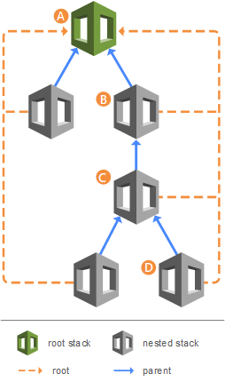

Cloud Formation
====

## Best Pracice Use Case 
***
Use CloudFormation to make changes to your landscape rather than going directly into the resources.
Make use of Change Sets to identify potential trouble spots in your updates.
Use Stack Policies to explicitly protect sensitive portions of your stack.
Use a version control system such as CodeCommit or GitHub to track changes to templates.


## 01 Anatomy

Let me demonstrate the basic skeleton of an AWS CLoudFormation template.

| Section | Description | required | 
| ---     | ---   | --- | 
| `AWSTemplateFormatVersion:` | **Format version defines the capability of a template.**| no | 
| `Description:` | ** describes the template**| no | 
| `Metadata:` | **ssh key in agent anzeigen**| no | 
| `Parameters:` | **Values to pass to your template**| no | 
| `Rules:` | **Validates a parameter or a combination of parameters**| no | 
| `Mappings:` | **Mostly to link Region to different AIM ID's**| no | 
| `Conditions:` | **Conditions that control whether certain resources are created or assigned a value**| no | 
| `Transform:` | **For serverless applications**| no | 
| `Resources :` | **Specifies the resources and their properties**| yes | 
| `Outputs :` | **Describes the values that are returned whenever you view your stack's properties**| no | 

## 02 Parameter

Parameters are used to give extra information while creating or updating your Stack or Nesteled Stack.

Like in this Example where we can decide if we want an S3 Endpoint deployed or not.

``` 
# This Parameter will be used to determine if an S3 endpoint should be added to the VPC or not 
Parameters:             # Settings of the Parameter
 S3Endpoint:            # Name of the Parameter 
    Description: 'Do you want to add a S3 endpoint to VPC'
    Type: String
    Default: true
    AllowedValues: [true, false]
```

## 03 Pseudo Parameter

Pseudo parameters are parameters that are predefined by AWS CloudFormation.

We can reference pseudo parameters just like regular parameters

```  
VPCModule: !Ref AWS::StackName
# Returns the Stack Name in my Case the Value is: VPC-DEV01 
```

**Common Pseudo Parameter are:**

| Section | Example Response | Description |
| ---     | ---   | --- |
| `AWS::Region` | eu-central-2 | Returns a string representing the Region |
| `AWS::Partition` | aws | Returns the partition that the resource is in normally aws / cloud be aws-us-gov |
| `AWS::StackId` | ?? | Returns the ID of the stack |
| `AWS::StackName` | VPC-DEV01 | Returns the name of the stack |
| `AWS::NotificationARNs` | ??| AWS::NotificationARNs |
| `AWS::AccountId` | ?? | Returns the AWS account ID  |
| `WS::NoValue` | ?? | Use in conditionals  |


## 04 Intrinsic Functions

Use intrinsic functions in your templates to assign values to properties that just get created within this Template now so are not yet running.

**!Ref**

A !Ref function returns the value of the named resource or parameter. It is used to retrieve the value of a resource or parameter and use it in another part of the template.

| YAML Shorthand | YAML | JSON |
| ---     | ---   | --- |
| `! Ref arg` | Fn::Ref arg | { "Fn::Ref": arg } |

```  
Parameters:                     # Settings of the Parameter
  VpcCIDR:                      # Here you can see the definition of the VpcCIDR Parameter
    Description: Please enter the IP range (CIDR notation) for this VPC
    Type: String
    Default: 10.192.0.0/16

Resources:                      # Creating of the Resources
  VPC:
    Type: AWS::EC2::VPC
    Properties:
      CidrBlock: !Ref VpcCIDR   # Here is the Reference to the VpcCIDR Parameter
```
----

**!Join**

A !Join function is used to construct a string value by Joining different parameters together.

| YAML Shorthand | YAML | 
| ---     | ---   |
| `! Join arg` | Fn::Join arg | 

| YAML | Output | 
| ---     | ---   | 
| `!Join [':',['a','b']]` | `'a:b'` | 

First define the Deliminator, than the Valve A , And Valve B = Join will put this Valve together in one String

**1. Example**
```  
Resource: !Join [ "", [ !GetAtt S3Bucket.Arn, "/*" ]]
# There is no Space to Connect Valve A = S3Bucket.Arn mit Valve B /*
# In our Case: arn:aws:s3:::firstdambackuptry/*
```

**2. Example**
```  
PublicSubnets:
    Value: !Join [ ",", [ !Ref PublicSubnet1, !Ref PublicSubnet2 ]]
# There is a "," Filler in the Output where Valve A is PublicSubnet1 and Valve B is PublicSubnet2
# In our Case: 
```  

**3. Example**
```  
!Join
  - ''
  - - 'arn:'
    - !Ref Partition
    - ':s3:::elasticbeanstalk-*-'
    - !Ref 'AWS::AccountId'
# Here we use the Ref function with the Partition parameter and the AWS::AccountId pseudo parameter (a fix System Parameter).
# In our Case: arn:aws:s3:::elasticbeanstalk-*-::AWS::id-0425af0359ec28474
```

**!Sub**

A !Sub function is used to inject the value into a string.

If you specify template parameter names or resource logical IDs, such as ${InstanceTypeParameter}, CloudFormation returns the same values as if you used the Ref intrinsic function. 
If you specify resource attributes, such as ${MyInstance.PublicIp}, CloudFormation returns the same values as if you used the Fn::GetAtt intrinsic function.

| YAML | Output | 
| ---     | ---   | 
| `!Sub 'a-${b}' | `Inject the value of "b" to the "a-" String | 

**1. Example**
```  
!Sub ssh ${DevInstance.PublicIp}
# Takes the Value of Dev.Instance.PublicIP and set it in front of the "ssh "
# In our Case: ssh 12.33.146.242
``` 

**2. Example List**
``` 
Name: !Sub 
  - 'www.${Domain}'
  - Domain: !Ref RootDomainName
``` 


**3. Example For UserData**
``` 
UserData:
  Fn::Base64:
    !Sub |
      #!/bin/bash -xe
      yum update -y aws-cfn-bootstrap
      /opt/aws/bin/cfn-init -v --stack ${AWS::StackName} --resource LaunchConfig --configsets wordpress_install --region ${AWS::Region}
``` 
----

**!GetAtt**

The !GetAtt retrieves the value of an attribute from a resource

The !GetAtt function takes two parameters: the logical name of the resource and the name of the attribute whose value you want to retrieve. The syntax is as follows

| YAML Shorthand | YAML | 
| ---     | ---   | --- |
| `!GetAtt logicalNameOfResource.attributeName` | Fn::GetAtt: [ logicalNameOfResource, attributeName ] | 

**Example**
``` 
# The NatGateway1EIP Resource
 NatGateway1EIP:
    Type: AWS::EC2::EIP
    DependsOn: InternetGatewayAttachment
    Properties:
      Domain: vpc

# We will get the NatGateway1EIP.AllocationId from the before created Resource 
 NatGateway1:
    Type: AWS::EC2::NatGateway
    Properties:
      AllocationId: !GetAtt NatGateway1EIP.AllocationId
``` 
----

## Conditions 
Conditions let's you make your template more reusable. 

CloudFormation evaluates all conditions in your template before creating any resources at stack creation or stack update

**Example**
``` 
Parameters:
  NatGateways:
    Type: String
    Default: true
    AllowedValues: [true, false]

Conditions:
  # Logical ID of Condition: Intrinsic funtion (!Equals) true if the Parameter is set to true
  WantNatGateways: !Equals [!Ref NatGateways, true]

Resource: 
  # Nat Gateway Nested
  VPCNatGateways:
    Condition: WantNatGateways
    Type: AWS::CloudFormation::Stack
    Properties:
``` 
----

## Outputs
Outputs enable you to get access to information about resources within a stack

Furthermore, output values can be imported into other stacks. These are known as cross-stack references.

**1. Example**
``` 
Outputs:
  PublicIPAddress:
    Description: The public IP address of the deployed instance
    Value: !GetAtt DevInstance.PublicIp

  WebsiteURL:
    Value: !Sub http://${DevInstance.PublicIp}
    Description: Application URL
``` 

**2. Example VPCID + Export**
``` 
Outputs:
 Value: !Ref VPC
    # In my Case: vpc-0425af0359ec28474 Same as AWS::StackId
    Export:
      Name: !Sub ${AWS::StackName}-Id
    # In my Case VPC-DEV01-Id
``` 
----

## Resource Dependencies
explicitly define resource creation order

**Example**
``` 
# Will create the InternetGatewayAttachment first before creating the here shown DefaultPublicRoute 
  DefaultPublicRoute:
    Type: AWS::EC2::Route
    DependsOn: InternetGatewayAttachment   
    Properties:
      RouteTableId: !Ref PublicRouteTable
      DestinationCidrBlock: 0.0.0.0/0
      GatewayId: !Ref InternetGateway
``` 
----

## Circular Dependencies
Error "Circular dependency between resources: 


**Example not working**
``` 
  WebTierSecurityGroup:
    Type: AWS::EC2::SecurityGroup
    Properties:
      GroupDescription: Security group for web instances
      GroupName: InternetFacing-SG
      SecurityGroupEgress:
        - Description: Allow HTTP
          IpProtocol: tcp
          FromPort: 80
          ToPort: 80
          SourceSecurityGroupId: !Ref GrafanaSecurityGrp

  GrafanaSecurityGrp:
    Type: AWS::EC2::SecurityGroup
    DependsOn: WebTierSecurityGroup
    Properties:
      GroupDescription: Allow HTTP and SSH In from LB Securtiy Group
      GroupName: GrafanaSecurityGrp
      SecurityGroupIngress:
        - Description: Allow HTTP
          IpProtocol: tcp
          FromPort: 80
          ToPort: 80
          SourceSecurityGroupId: !Ref WebTierSecurityGroup
``` 

**Example working**
```
  GrafanaSecurityGrp:
    Type: AWS::EC2::SecurityGroup
    Properties:
      GroupDescription: Allow HTTP and SSH In from LB Securtiy Group
      GroupName: GrafanaSecurityGrp
      VpcId:
        !ImportValue 
          Fn::Sub: '${VPCModule}-ID'
      #VpcId: Fn::ImportValue 
      #  !Sub '${VPCModule}-ID'
      SecurityGroupIngress:
        - Description: Allow SSH
          IpProtocol: tcp
          FromPort: 22
          ToPort: 22
          CidrIp: 0.0.0.0/0

  InstanceSecurityGroupIngress:
    Type: AWS::EC2::SecurityGroupIngress
    DependsOn: WebTierSecurityGroup
    Properties:
      Description: Security Group Rule between Instance and LB 
      GroupId: !Ref GrafanaSecurityGrp
      IpProtocol: tcp 
      FromPort: 80 
      ToPort: 80
      SourceSecurityGroupId: !Ref WebTierSecurityGroup
```
----

## Nested stacks 
Reusing common template patterns using nested stacks is efficient and considered a best practice in CloudFormation



**Example**
``` 
# Nesting a stack in a template s3bucket.yaml -> Giving the Parameters to the Nested Stack
  s3BucketModule:
    Type: AWS::CloudFormation::Stack
    Properties:
        Parameters:
          s3BucketfirstName: private-bucket-dam
          ValueEnviroment: !Ref EnvironmentName
        TemplateURL: 'https://config-bucket-931336182845.s3.eu-central-2.amazonaws.com/s3bucket.yaml'
``` 
## Pass variables from another nested stack 
Grab Output from one Nested Stack and pass it to another Nested Stack

**Example**

Ec2 stack snippet
```
Outputs:
  PublicIPAddress:
    Description: The public IP address of the deployed instance
    Value: !GetAtt DevInstance.PublicIp
```

Main Stack snippets
```
# The Stack we are getting the Output from
VPCEc2Instance:
    Condition: WantEC2
    Type: AWS::CloudFormation::Stack
    Properties:
      TemplateURL: https://config-bucket-931336182845.s3.eu-central-2.amazonaws.com/simpleec2.yaml

# The Stack we are passing the Output to 
  VPCEc3Instance:
    Condition: WantEC3
    Type: AWS::CloudFormation::Stack
    Properties:
      TemplateURL: https://config-bucket-931336182845.s3.eu-central-2.amazonaws.com/simpleec3.yaml
      Parameters:
        VPCModule: !Ref AWS::StackName
        IPEc2Instance: !GetAtt VPCEc2Instance.Outputs.PublicIPAddress

# Outputs from the main Stack 
Outputs:
  IPEc2InstanceID:
    Description: The Public IP Address of the Ec2 Template
    Value: !GetAtt VPCEc2Instance.Outputs.PublicIPAddress
```
----

## Mappings 
Mapping is nothing alse than a simple lookup table. 

One common use case is to define a mapping between AMI and AWS Regions like in this example.

**Example**
```
Mappings:
  AMIMap:
    eu-central-1:
      Ubuntu22: ami-0ec7f9846da6b0f61
      Ubuntu20: ami-0d497a49e7d359666
      Amazon: ami-0b7fd829e7758b06d
    eu-central-2:
      Ubuntu22: ami-08c947c038321a605
      Ubuntu20: ami-04fe12af5cb123aec
      Amazon: ami-0a407ff3659b37106
Resources:
  EC2Instance:
    Type: AWS::EC2::Instance
    Properties:
      ImageId: !FindInMap [AMIMap, !Ref 'AWS::Region', Ubuntu22]
      InstanceType: t2.micro
```


# CLI

## Validating a template
Sometimes a CloudFormation template deployment will fail due to syntax errors in the template.

**Example**
```
aws cloudformation validate-template --template-body file://cloudformation_VPC_2.yaml 
```

If successful, CloudFormation will send you a response with a list of parameters, template description and capabilities.
----

## Deploy Stack 
The aws cloudformation deploy  command is used to deploy CloudFormation templates using the CLI.

**Example**
When using the CLI, you are also required to acknowledge this stack might create resources that can affect IAM permissions
--capabilities CAPABILITY_IAM

Stack will not be deleted when failed to Deploy
--disable-rollback

Parameter NatGateways set to false 
--parameters ParameterKey=NatGateways,ParameterValue=false

Different AWS CLI profiles can be created in the ~/.aws/credentials File
--profile Swisscom

```
aws cloudformation create-stack \
    --stack-name VPC-DEV01 \
    --template-body file://cloudformation_VPC_2.yaml \
    --capabilities CAPABILITY_IAM \
    --disable-rollback \
    --parameters ParameterKey=NatGateways,ParameterValue=false \
    --profile Swisscom
```

------
Source: 

- [**CloudFormation 101**](https://catalog.workshops.aws/cfn101/en-US/basics/templates)
- [**template anatomy:**](https://docs.aws.amazon.com/AWSCloudFormation/latest/UserGuide/template-anatomy.html)
- [**AWS CloudFormation Cheat Sheet**](https://www.bluematador.com/blog/aws-cloudformation-cheat-sheet)
- [**Pseudo Parameter**](https://docs.aws.amazon.com/AWSCloudFormation/latest/UserGuide/pseudo-parameter-reference.html)
- [**!Ref:**](https://docs.aws.amazon.com/AWSCloudFormation/latest/UserGuide/intrinsic-function-reference-ref.html)
- [**!Sub:**](https://docs.aws.amazon.com/AWSCloudFormation/latest/UserGuide/intrinsic-function-reference-sub.html)
- [**!Join:**](https://docs.aws.amazon.com/AWSCloudFormation/latest/UserGuide/intrinsic-function-reference-join.html)
- [**Conditions:**](https://catalog.workshops.aws/cfn101/en-US/intermediate/templates/conditions)
- [**Mapping:**](https://catalog.workshops.aws/cfn101/en-US/basics/templates/mappings)
- [**Pass variable :**](https://repost.aws/knowledge-center/cloudformation-nested-stacks-values)
- [**Mapping:**](https://docs.aws.amazon.com/AWSCloudFormation/latest/UserGuide/quickref-cloudformation.html)
- [**CircularDependency:**](https://aws.amazon.com/blogs/infrastructure-and-automation/handling-circular-dependency-errors-in-aws-cloudformation/)
 

---

> [⇧ **Back to top**](#01-Anatomy)

---

