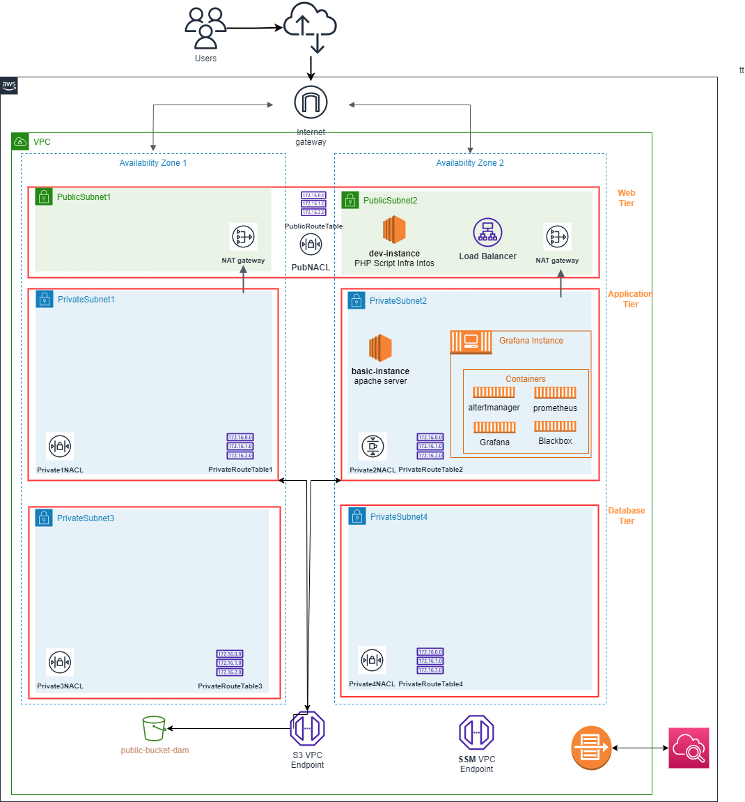

AWS Infrastructure as Code
==== 

TBZ Semster Arbeit Dany / Roger

## Table of Content

* 00 - [Summary](#01-Summary)
* 01 - [Introduction IAC](#01-Introduction-IAC)
* 02 - [AWS CloudFormation Cheat Sheet](#02-AWS-CloudFormation-Cheat-Sheet)
* 03 - [Project](#03-Project)
* 04 - [How to Deploy](#04-How-to-Deploy)
* 05 - [AWS Well Architected Framework ](#05-AWS-Well-Architected-Framework)
* 05 - [Conclusion](#06-Conclusion)

## 00 Summary

| Projectname | ITCNE23-SEM-I |
|---|---|
| Sub-project name | AWS Infrastructure as Code  |
| Project lecturer | Rohr Philipp |
| Subject lecturer | Calisto Marcello |
| Sub-project leader | Dany Ambühl  |
| Initial position | In this term paper, I will automatically deploy a basic AWS infrastructure using AWS Cloud Formation. It will also integrate Roger Blum's monitoring solution |
| Goals  | - Deploy a highly available architecture |
|   | - Include various basic AWS infrastructure services |
|   | - Built according to AWS best practices  |
|   | - Build flexible CloudFormation templates  |
|   | - Integrate Roger's monitoring solution |
| Milestones | 1.Sprint - Project kickoff finished, Individual tasks started iac and monitoring |
|  | 2.Sprint - Definition and implementation of the dependencies and first testings iac - monitoring |
|  | 3.Sprint - Finish prio A tasks, join the two sub-projectsand extensive testing 
|  | 4.Sprint - Conclusion, Work acceptance and Presentation |

## 01 Introduction IAC

**What is IaC?**

> mature technology used by DevOps teams to automate resource provisioning on the cloud

**What is**
 
> Amazon provides its own IaC platform called CloudFormation, it provisions and configures resources based on a template you create, which specifies the resources you require (such as EC2 instances or RDS DB instances, ...)

**What format is the code in?**

> The template you use in CloudFormation template will be a text file in JSON or YAML format 

**What is the project's main mission?**

```
- Automate Infrastructure Provisionen with Cloudformation.
- Deploy a highly available architecture with a reliable 3-tier infrastructure that spans two availability zones.
- Managed network address translation (NAT) gateways to allow outbound internet access for resources in the private subnets.
- Dedicated custom network access control lists (ACLs) for each Availability Zone.
- A single routing table for the public subnet, because the public subnets all use the same Internet gateway as the only route to communicate with the Internet.
- Dedicated custom network ACLs for each Availability Zone
- An independent routing table for each private subnet configured to control the flow of traffic within and outside the VPC.
- Spare capacity for adding subnets to support your environment as it grows.
- a VPC gateway endpoint for Amazon Simple Storage Service (Amazon S3). This endpoint provides a secure, reliable connection to Amazon S3
- A layered architecture organizes stacks into multiple horizontal layers that build on top of one another. 
- Include various basic AWS infrastructure services such as SSM / Endpoints / NAT Gateway / Security Groups / NACL / Flow Log / EFS / EC2 / Load Balancer / S3 Bucket
- Built according to AWS best practices and the AWS Well-Architected Framework.
- Build flexible CloudFormation templates with detailed code comments and a cheat sheet to explain the CloudFormation code used.
- Integrate Roger's monitoring solution into my AWS infrastructure and provision various services for monitoring.
- Use a version control system such as CodeCommit or GitHub to track changes to templates.
```

> while following the best practices outlined in the AWS Well-Architected Framework.

**What is the secondary mission of the project?**

> By providing an accessible platform, this project will enable individuals to gain valuable experience in CloudFormation scripting, as well as an understanding of > the fundamentals and possibility's of CloudFormation.

> This project aims to demonstrate multiple approaches for connecting different CloudFormation scripts together and the implementation will be extensively explained > and commented on to make each step easy to understand. 

**Infrastructure architecture**


## 02 AWS CloudFormation Cheat Sheet

This AWS CloudFormation Cheat Sheet is a quick, self-made reference guide that will provide you with a complete list of all the features that are used in my script.

- [**Full Cheat Sheet**](Cheat_Sheet_Cloud_Formation.md)

  

For keeping the scop of this project reasonable, the guide is described just in YAML and with man practical examples from the Template, it's designed to help you to understand the fundamentals and the possibility's of CloudFormation.
## 03 Project  

Here is the full project planning overview of the AWS infrastructure that will be used for the project.

- [**AWS IAC project planning**](awsproject.md)



## 04 How to Deploy 

Here i will describe how the Template can be deployed via AWS CLI 
 
  


- [**How to Deploy via CLI**](howtodeploy.md)

## 05 AWS Well Architected Framework 

By using the Framework you will learn architectural best practices for designing and operating reliable, secure, efficient, cost-effective, and sustainable systems in the cloud.

> The AWS Well-Architected Framework describes key concepts, design principles, and architectural best practices for designing and running workloads in the cloud.

**Benefits of a 3 Tier Architecture**
- Decreased development time — different teams can work on different tiers simultaneously, resulting in decreased time to deploy
- Increased scalability — a tier can have an auto-scaling group independent of other tiers, meaning for each tier, you only use what you need
- Increased reliability — each tier can have multiple resources in multiple availability zones and the success and availability of one tier is independent of the other tiers
- Increased security — each tier can have its own security group, allowing for custom permissions depending on the needs of that tier
- Increased security — each tier can have its own NACL, allowing for custom permissions depending on the needs of that tier

A highly available architecture that spans two to four Availability Zones.

> Thats why i used two Availability Zones and 3 Tier Architecture for my VPC design.

**VPC/CIDR**
The RFC recommended private address space:

| RFC1918 RANGE| Example CIDR block | 
| ---     | ---   | 
| `10.0.0.0 - 10.255.255.255`| 10.0.0.0/16 | 
| `172.16.0.0 - 172.31.255.255`| 172.31.0.0/16 | 
| `192.168.0.0 - 192.168.255.255`| 192.168.0.0/20 | 

Spare capacity for adding subnets to support your environment as it grows.

> Thats why i used 10.42.0.0/16 for my VPC design. And a /24 Prefix for each subnet.

**Gateway and Endpoint**

> This endpoint's provides a secure, reliable connection to Amazon S3, EC2Messages, SSMMessages and SSMVPCManager without requiring an internet gateway, NAT gateway, or virtual private gateway.

- SSM Manager allows you to manage your EC2 instances instances through a hybrid environment by using **Systems Manager** without the need for SSH or RDP connections.
- Place your product instances in private subnets, and route private subnet traffic through **NAT gateways** that are configured in public subnets
- Integrate AWS Flow Logs with Amazon CloudWatch Logs to monitor the network traffic in your VPC.

**Stacks**

- A layered architecture organizes stacks into multiple horizontal layers that build on top of one another. 
- Use dynamic export names to export values from one stack to another.
- Use cross-stack references to export shared resources
- Use IAM to control access to resources
- Use pseudo parameters to promote portability
- Validate templates before using them
- Use Cloud Init to deploy software packages and run commands
- Use Termination Protection for critical stacks
- Make your code more readable and use short yaml syntax for CloudFormation
- Add comments to your code to make it easier to understand
- Use Parameters to make your code more flexible
- Use test / prod parameters to deploy the same template in different sizes and environments
- implementing conditions to make your code more reusable
- Use dynamic references between resources to make your code more reusable

**Security Groups**

- Always use security groups and IAM roles to limit access to resources. (deploying a template)
- Implement Network Segmentation: Segment your network by using multiple security groups and subnets to create different security boundaries.
- Use Security Group IDs Instead of IP Addresses: Rather than relying on specific IP addresses, use security group IDs whenever possible..
- Limit access to security groups
- Isolate different types of resources into separate security groups
- Limit Outbound Traffic: Restrict outbound traffic to only the necessary ports

## 06 Conclusion

**In conclusion**, I can say that the journey of working on the AWS CloudFormation project has been an extremely learning and challenging experience. Through this undertaking, I have gained a broader understanding of Infrastructure as Code (IaC) and the possibilities it offers in the automation and deployment of AWS resources.

While working on this project, it became clear that the complexity of the CloudFormation template was growing tremendous as more resources and configurations were added. 
For this reason, it helped me to build the template gradually, adding services and to test it after each step.

I have deepened my understanding of the AWS CLI and its capabilities for automating various tasks related to AWS resource provisioning 
Particularly in terms of gaining hands-on experience with the AWS CLI deploying s3 buckets, iam users, put-user-policy, create-role, describe-stacks, deploy stacks and packages. 

**In retrospect**, I realised that further modularising the CloudFormation template would have greatly improved its maintainability, readability and reusability.
Specifically, the NACL and Security Group sections of the template could have been modularised into separate files and then referenced in the main template. This would have made the template more readable and easier to maintain.
Further more Improving the testability capabilities to validate the functionality of the individual resources would have been a great benefit.


Although this project has been a remarkable journey, it is important to acknowledge that certain components I have **not been able to be integrated** due to time constraints and the scope of the project:

- consistent tagging strategy
- consistent naming strategy
- consistent single quotes for strings to avoid errors when using special characters
- Reuse template to replicate stacks in multiple environments. (Ec2 and Ec3)
- Limit Outbound Traffic: Restrict outbound traffic to only the necessary ports
- Deploying -creating IAM User for Roger directly in a Cloudformation template
- Deploying Prerequisite - IAM CloudFormation User directly in a Cloudformation template
- S3 Bucket Nested Stack can not be deployed consistently
- The Attached NFS Share could not get implemented with Rogers Container


