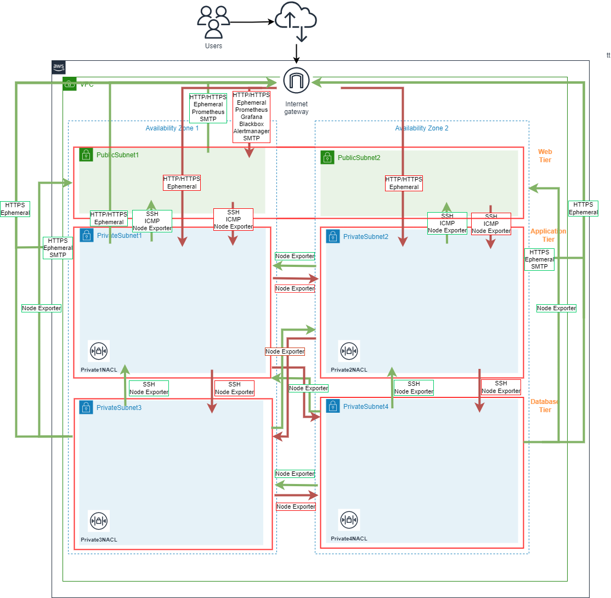

Definition IAC Project
==== 

## Table of Content


* 01 - [SMART Objectives](#03-SMART-Objectives)
* 02 - [Seusag](#04-Seusag)
* 03 - [Port Matrix](#03-Port-Matrix)
* 04 - [Dependencies](#04-Dependencies)


## 01 SMART Objectives

###  IaC Infrastructure as Code Smart Goals


Here i list 4 smart goals for the IaC part of the project, to provide a clear roadmap.

**1. Goal: Automate Infrastructure Provisioning with CloudFormation**

```
- Specific:            - Develop a yaml CloudFormation templates to automate the provisioning of infrastructure resources in AWS. 
- Measurable:          - Successfully provision infrastructure resources using CloudFormation templates with running AWS Services in two different AZ's. 
- Achievable:          - I have done a lot of learning before and I have the knowledge to do it.
- Realistic:           - I have the time and the resources to do it.
- Timely:              - I have until 2.Sprint to finish the task.
```

**2. Goal: Deploy a Highly Available 3-Tier Architecture Across Two Availability Zones**

```
- Specific:            - Design and deploy a three-tier architecture across two AWS availability zones, ensuring high availability and fault tolerance. 
- Measurable:          - Successfully create and launch instances for each tier (web, application, database) in separate subnets.
- Achievable:          - Utilize AWS services like Amazon EC2, , Elastic Load Balancing to distribute resources across availability zones.
- Realistic:           - I understand the concepts and did already some lab about it.
- Timely:              - I have until 2.Sprint to finish the task.
```

**3. Goal: Implement VPC Gateway Endpoint for Amazon S3**

```
- Specific:            - Organize the infrastructure stacks into multiple vertical layers that build on top of one another
- Measurable:          - Make nested stacks for each layer and deploy them in the correct order.
- Achievable:          - Create separate stack templates for each layer and defining the appropriate resources and dependencies for each layer.
- Relevant:            - Implementing a VPC gateway endpoint for Amazon S3 will enhance security by allowing private access to S3 resources.
- Timely:              - Complete the configuration and testing of the VPC gateway endpoint for Amazon S3 within Sprint 2.
```

**4. Goal: Implement Layered Architecture for Stacks**

```
- Specific:            - Enabling private access to S3 resources by configure a VPC gateway endpoint. 
- Measurable:          - Ensuring that resources within the VPC can securely access S3 without traversing the internet gateway.
- Achievable:          - Utilize AWS VPC features and services to set up a VPC gateway endpoint specifically for Amazon S3.
- Relevant:            - Implementing a layered architecture will provide modularity and is alined with AWS best practices.
- Timely:              - Complete the implementation of the layered architecture for your stacks within Sprint 1. 
```

## 02 Seusag

I am going to deploy the infrastructure using CloudFormation and provide the underlying network infrastructure as shown in the diagram below.
This includes two Linux Ec2 instances with a web server installed on each one.

For the monitoring solution he is developing, Roger will provide the UserData code and the Port Matrix like highlighted in Red in the diagram below. 

And by implementing its user data in CloudFormation, I will integrate this monitoring solution into the infrastructure.

> Here is a diagram showing the integration of the monitoring resources into the underlying AWS infrastructure and their interdependencies with interfaces and ports.


## 03 Port Matrix

Here is a diagram showing the port matrix for the IaC part of the project.


Table of the Port Matrix

| Port | Protocol | Source | DestinationCidrBlock | Description | 
| ---     | --- | ---  | --- | --- |
| 22 | SSH | --- | ---  | Needed for Troubleshooting |
| 80 | HTTP | Subnet1 | Internet | Needed for the Loadbalancer |
| 80 | HTTP | Internet | Subnet1 | Needed for the Ubuntu Update |
| 443 | HTTPS | Subnet1 | Internet | Needed for yum update |
| 587 | SMTP | Subnet2 | Internet | SMTP Gmail |
| 1024 - 65535 | HTTP | Subnet1 | Internet | Needed for yum update |
| 1024 - 65535 | HTTP | Subnet1 | Internet | Needed for yum update |
| 3000 | TCP | Internet | Subnet2 | Needed for Grafana Dashboard |
| 9090 | TCP | Internet | Subnet2 | Needed for Prometheus Dashboard |
| 9093 | TCP | Internet | Subnet2 | Needed for Alertmanager Dashboard |
| 9100 | TCP | VPC | VPC | Needed for Prometeo Node exporter |
| 9115 | TCP | Internet | Subnet2 | Needed for Blackbox Dashboard |


## 04 Dependencies

### IaC Cross Stack Dependencies

Here is a diagram showing the cross stack dependencies for the IaC part of the project.
Where the VPC stack is the base stack and the other stacks are dependent on it, are built on top of it and Userdata information is provided by Roger.

