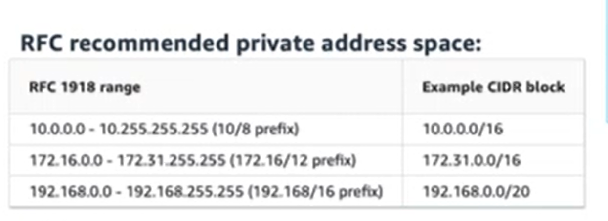

## AWS 3 Tier Architecture

Expect Auto Dokumentaiton erstellt von yaml file -> Tool ?
Verschiedene templates um deine umgebung flexible einzubauen  

**Benefits of a 3 Tier Architecture**
- Decreased development time — different teams can work on different tiers simultaneously, resulting in decreased time to deploy
- Increased scalability — a tier can have an auto-scaling group independent of other tiers, meaning for each tier, you only use what you need
- Increased reliability — each tier can have multiple resources in multiple availability zones and the success and availability of one tier is independent of the other tiers
- Increased security — each tier can have its own security group, allowing for custom permissions depending on the needs of that tier

## VPC CIDR

## Infrastructure best practice:

A highly available architecture that spans two to four Availability Zones.

A virtual private cloud (VPC) configured with public and private subnets, according to AWS best practices, to provide you with your own virtual network on AWS. The VPC provides Domain Name System (DNS) resolution.

## In the private subnets:

Spare capacity for adding subnets to support your environment as it grows.

## A VPC gateway endpoint for Amazon Simple Storage Service (Amazon S3). This endpoint provides a secure, reliable connection to Amazon S3 without requiring an internet gateway, NAT gateway, or virtual private gateway. The endpoint uses the default endpoint policy, which gives any user or service within the VPC full access to Amazon S3 resources

Links Subnet: https://docs.aws.amazon.com/vpc/latest/userguide/configure-subnets.html#subnet-basics
Link s3 Gateway : https://docs.aws.amazon.com/vpc/latest/privatelink/vpc-endpoints-s3.html

Quelle: https://github.com/aws-quickstart/quickstart-aws-vpc

## Best practices with the AWS CDK  -> https://docs.aws.amazon.com/cdk/v2/guide/best-practices.html

optionally have a pipeline for automated deployments.

"landing zone" that defines your organizational units within AWS = A landing zone is a pre-configured, secure, scalable, multi-account AWS environment based on best practice blueprints -> Use AWS Control Tower 

When packages begin to be used in multiple applications, move them to their own repository. 

or example, if one of your logical units is a website, the constructs that make it up (such as an Amazon S3 bucket, API Gateway, Lambda functions, or Amazon RDS tables) should be composed into a single high-level construct. Then that construct should be instantiated in one or more stacks for deployment.

Treat AWS CloudFormation as an implementation detail that the AWS CDK uses for robust cloud deployments, not as a language target. You're not writing AWS CloudFormation templates in TypeScript or Python, you're writing CDK code that happens to use CloudFormation for deployment.

Separate your application into multiple stacks as dictated by deployment requirements

# Best Pracice CloudFormation Stacks 

A layered architecture organizes stacks into multiple horizontal layers that build on top of one another. 

## game days