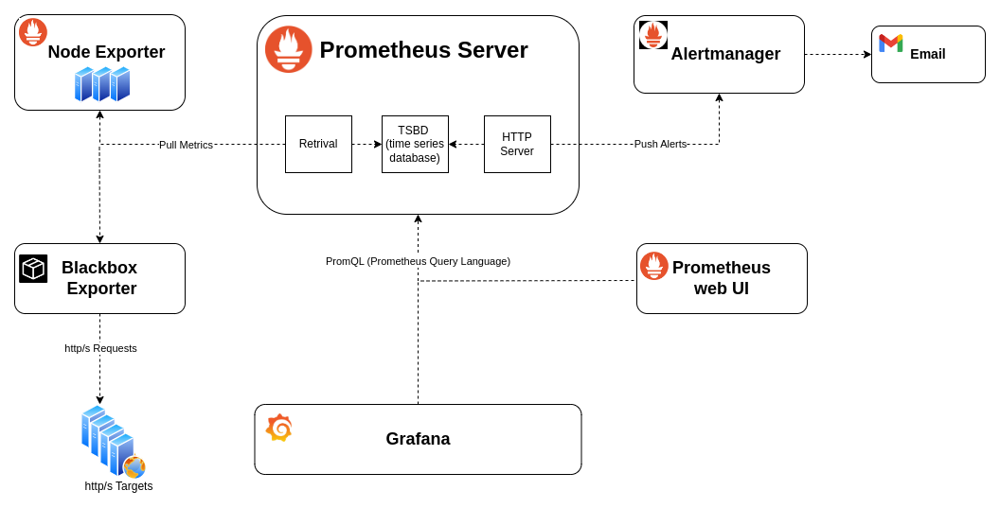
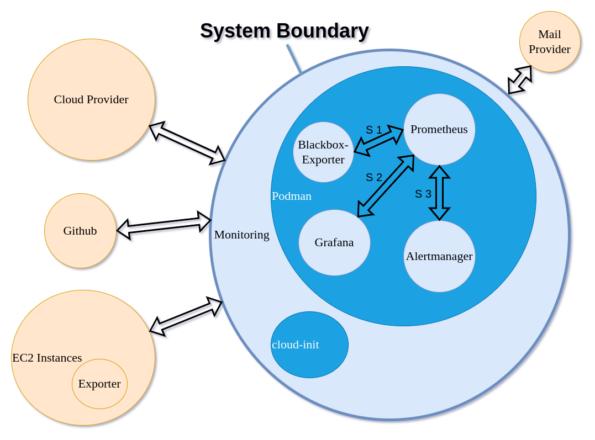
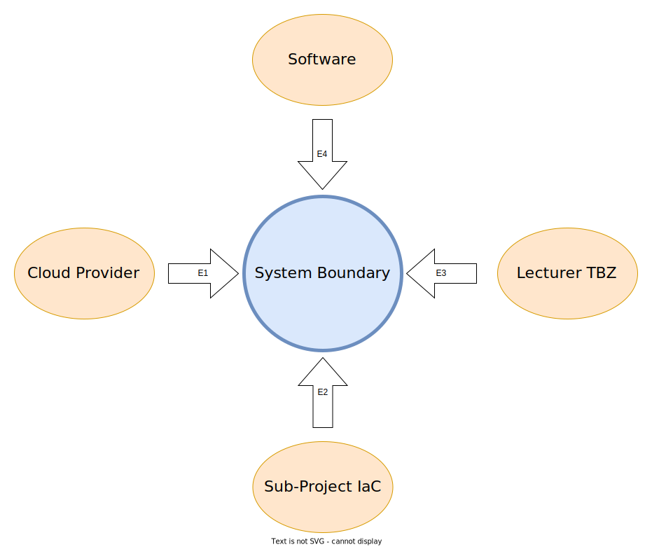
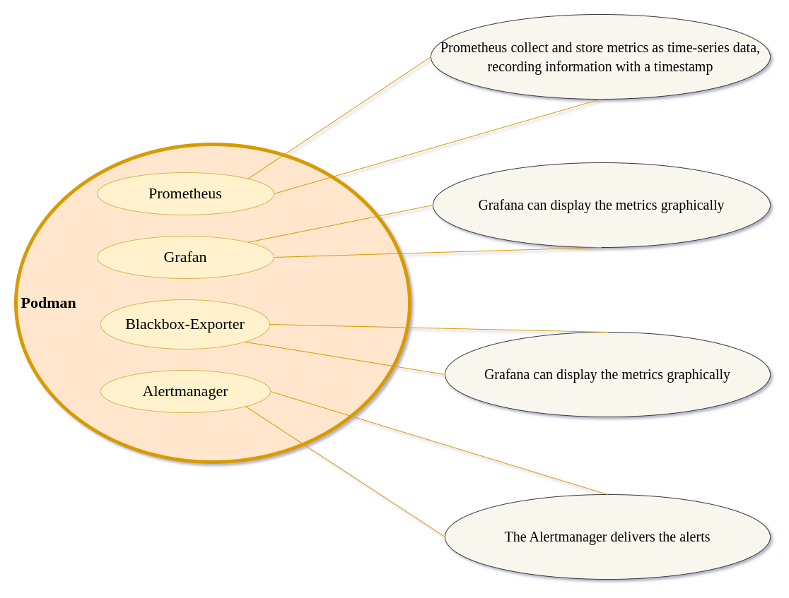

# Monitoring

## Table of conten
* 1       - [Summary](#1-summary)
* 2       - [Introduction](#2-introduction)
* 2.1     - [Initial-Position](#21-initial-position)
* 2.2     - [Mission](#22-mission)
* 2.2.1   - [Monitoring Overview](#221-monitoring-overview)
* 2.3     - [Sources](#23-sources)
* 2.3.1   - [Podman](#231-podman)
* 2.3.1.1 - [Podman-Compose](#2311-podman-compose)
* 2.3.2   - [Docker Images](#232-docker-official-image)
* 2.3.3   - [Node-Exporter](#233-node-exporter)
* 2.3.4   - [Apache-Exporter](#234-apache-exporter)
* 2.3.5   - [Multipass](#235-multipass)
* 2.3.6   - [git](#236-git)
* 2.3.7   - [Drawio](#237-drawio)
* 3       - [SEUSAG](#3-seusag)
* 3.1     - [System Boundary / Interface](#31-system-boundary--interface)
* 3.2     - [Influencing Factors](#32-influencing-factors)
* 3.3     - [Sub- and Partsystems](#33-sub--and-part-systems)
* 3.4     - [System Boundary](#34-system-boundary)
* 3.5     - [Influencing Factors and Restrictions](#35-influencing-factors-and-restrictions)
* 3.6     - [Subsystem](#36-subsystem)
* 3.7     - [Inferfaces](#37-interfaces)
* 3.7.1   - [Portmatrix](#371-portmatrix)
* 4       - [Project Goals](#4-project-goals)
* 4.1     - [Procedural Goals](#41-procedural-goals)
* 4.2     - [System Golas](#42-system-goals)
* 5       - [Appreciation](#5-appreciation-swot-analysis)
* 5.1     - [Strengths](#51-strengths)
* 5.2     - [Weaknesses](#52-weaknesses)
* 5.3     - [Opportunities](#53-opportunities)
* 5.4     - [Threats](#54-threats)
* 6       - [Project Planning](#6-project-planning)
* 6.1     - [Project Management Tools](#61-projectmanagement-tools)
* 6.2     - [Tasks](#62-tasks)

---

## 1 Summary

| 
Projectname
 | ITCNE23-SEM-I |
|---|---|
| Subproject name | Monitoring  |
| Project lecturer | Rohr Philipp |
| Subject lecturer | Calisto Marcello |
| Subproject leader | Roger Blum  |
| Initial position | With this semester work, a monitoring should be made available, which can be automatically started up in the AWS-Cloud and can be used for existing and new servers. |
| Goals  | Automated installation of the monitoring components using Cloud-Init   Dashboard for EC2 Instances / Apache  Alerting based on defined threshold values via email  Setup of monitoring via Github  Integration into sub-project (ICA) from Dany Ambühl |
| Task | The software is operated using containers, which are managed using prodman based on the POC   Resource planning and tasks are planned in github   |

---

## 2 Introduction

### 2.1 Initial position
Cloud computing" is the on-demand delivery of IT resources over the Internet at pay-as-you-go prices. Instead of purchasing, owning, and maintaining physical data centers and servers, you can access technology services on an as-needed basis through a cloud provider such as Amazon Web Services (AWS). such as computing power, memory and databases.

AWS offers monitoring by default, which can only be adapted to your own needs to a limited extent.

### 2.2 Mission
As part of this semester work, an open source monitoring solution is to be made available.
The solution can be made available in the AWS cloud with simple steps and can be adapted to individual needs.

#### 2.2.1 Monitoring Overview

### 2.3 Sources
Different software is used for this project. The link to the source can be found in the list below. 
A short software description and a link to the official website can be found in point [3.6 Subsystem](#36-subsystem).

#### 2.3.1 Podman
- [Podman](https://github.com/containers/podman.io)

##### 2.3.1.1 Podman-compose
- [Podman-Compose](https://github.com/containers/podman-compose)

#### 2.3.2 Docker Official Image
- [Prometheus](https://hub.docker.com/r/prom/prometheus)
- [Alertmanager](https://hub.docker.com/r/prom/alertmanager)
- [Blackbox-Exporter](https://hub.docker.com/r/prom/blackbox-exporter)
- [Grafana](https://hub.docker.com/r/grafana/grafana)

#### 2.3.3 Node Exporter
- [Node-Exporter](https://github.com/prometheus/node_exporter)

#### 2.3.4 Apache Exporter
- [Apache-Exporter](https://github.com/Lusitaniae/apache_exporter)

#### 2.3.5 Multipass
- [Mltipass](https://multipass.run/)

#### 2.3.6 Git
- [Git](https://git-scm.com/download/linux)

#### 2.3.7 Draw.io
- [Draw.io](https://github.com/jgraph/drawio-desktop)

---

## 3. SEUSAG

### 3.1 System boundary / Interface

### 3.2 Influencing factors

### 3.3 Sub- and part systems

### 3.4 System boundary
The following elements that are directly related to the monitoring have been included within the system boundary.
- Podman
- Prometheus
- Alertmanager
- Blackbox-Exporter
- Grafana
- Cloud-init

The following elements are not directly related to the monitoring and were defined outside the system boundary.
- Cloud Provider
- Mail Provider 
- EC2 Instances
- Github
- Exporter

### 3.5 Influencing factors and restrictions
The project is limited to the installation and execution of the monitoring software.

| number | factor | restrictions |
|---|---|---|
| E1 | Cloud Provider | Die Monitoring Software installation mit cloud-init ist Provider neutral. Es wurde für die AWS sowie Multipass getestet. |
| E2 | Sub Project IaC | The monitoring also works independently. However, there is a dependency in relation to the overall project. The risk can be extremely minimized in close cooperation with Dany Ambühl (subproject IaC). |
| E3 | Lecturer TBZ | The lecturers check the project for content and function and can instruct it to be aborted. The risk can be minimized by regular comparison with the lecturers. |
| E4 | Software | Open source products are used to operate the monitoring software.  To minimize the risk, all software could be downloaded additionally. However, this measure is waived. |

### 3.6 Subsystem
#### 3.6.1 Prometheus
Prometheus is free software for service monitoring and real-time alerting of IT infrastructures. Prometheus queries real-time metrics from applications via HTTP and records them in a time-series database.

- Official site: [Prometheus](https://prometheus.io/docs/introduction/overview/)

#### 3.6.2 Node Exporter
The Prometheus Node Exporter exposes a wide variety of hardware- and kernel-related metrics.

- Offical site: [Node Exporter](https://prometheus.io/docs/guides/node-exporter/)

#### 3.6.3 Alertmanager
The Alertmanager handles alerts sent by client applications such as the Prometheus server. It takes care of deduplicating, grouping, and routing them to the correct receiver integrations such as email, PagerDuty, OpsGenie, or many other mechanisms thanks to the webhook receiver. It also takes care of silencing and inhibition of alerts.

- Official site: [Alertmanager](https://github.com/prometheus/alertmanager)

#### 3.6.4 Grafana
Grafana allows you to query, visualize, alert on and understand your metrics no matter where they are stored. Create, explore, and share dashboards with your team and foster a data driven culture.

- Offical site: [Grafana](https://grafana.com/oss/grafana/)

#### 3.6.5 Podman
Podman (Pod Manager) is a fully featured container engine. Podman provides a Docker-CLI comparable command line that eases the transition from other container engines and allows the management of pods, containers and images. 

- Official site: [Podman](https://podman.io/get-started)

*At the suggestion of the lecturer Calisto Marcello, Docker was replaced with Podman.*

#### 3.6.6 Github
GitHub is an Internet hosting service for software development and version control using Git. It provides the distributed version control of Git plus access control, bug tracking, software feature requests, task management, continuous integration, and wikis for every project.

Github is used in this project to manage the monitoring setup.

- Official site: [github](https://github.com/)

### 3.7 Interfaces
| Schnittstelle | 
Element
 | Description |
|---------------|---------|-------------|
| S1 | Prometheus / Blackbox-Exporter |Prometheus pulls the metrics from the Blackbox-Exporter and stores them in its time series database.|
| S2 | Grafana / Prometheus | Grafana reads the metrics form time series database from prometheus, this data can be presented graphically in the form of a dashboard.|
| S3 | Promethes / Alertmanager | Prometheus pushes the alerts to the alert manager, from where they are sent. |

#### 3.7.1 Portmatrix

| Application | Port | Direction |
|---|---|---|
| Prometheus | 9090 | inbound |
| Node Exporter | 9100 |  inbound |
| Blackbox Exporter | 9115 | inboud |
| Alertmanager | 9093 | inbound |
| Grafan |  3000 | inbound |
| SSH | 22 | inbound |
| http | 80 | outbound |
| https | 443 | outbound |
| smtp | 587 | outbound |

---

## 4. Project goals

### 4.1 Procedural goals

| Goals | Dates |
|---|---|
|Shared github repository with Dany Ambühl, enabling agile collaboration.The repository should be public. This means that the current status can be understood at any time and the project planning / project progress can be seen. | Sprint 1 |

### 4.2 System goals

| Goals | Dates |
|---|---|
|The software components are installed on an AWS EC2 instance using cloud-init. | Sprint 1 |
|Dashboard for EC2 Instances, which provides information about CPU, Memory, Disk usage. The Dashobard should be accessible from the Internet and be able to be customized.| Sprint 2 |
|Dashboard for Apache Service, which shows the availability of the service (http status code, http duration). The Dashobard should be accessible via the Internet and be able to be individually adjusted. | Sprint 2 |
|Alerting based on defined threshold values by e-mail (Fring / Resolved).| Sprint 3 | 

## 5. Appreciation (SWOT-Analysis)

### 5.1 Strengths
- No license costs due to open source products
- Easy installation due to cloud-init
- Provider independent

### 5.2 Weaknesses
- Cloud-init only tested on Ubuntu 22.04
- Cloud-init code for Debian derivatives only

### 5.3 Opportunities
- Improving AWS know-how through the IaC Project from Dany
- Improving know-how for project management with Github
- Gained know-how can be used in business

### 5.4 Threats
- Monitoring setup is too static (IP addresses)
- There is not enough time for project management and practical implementation
- The two projects Iac / Monitoring do not work together

---

## 6. Projectmanagement
The project management documentation can be found under the following link:
- [**Project Documentation**](../project/README.md)