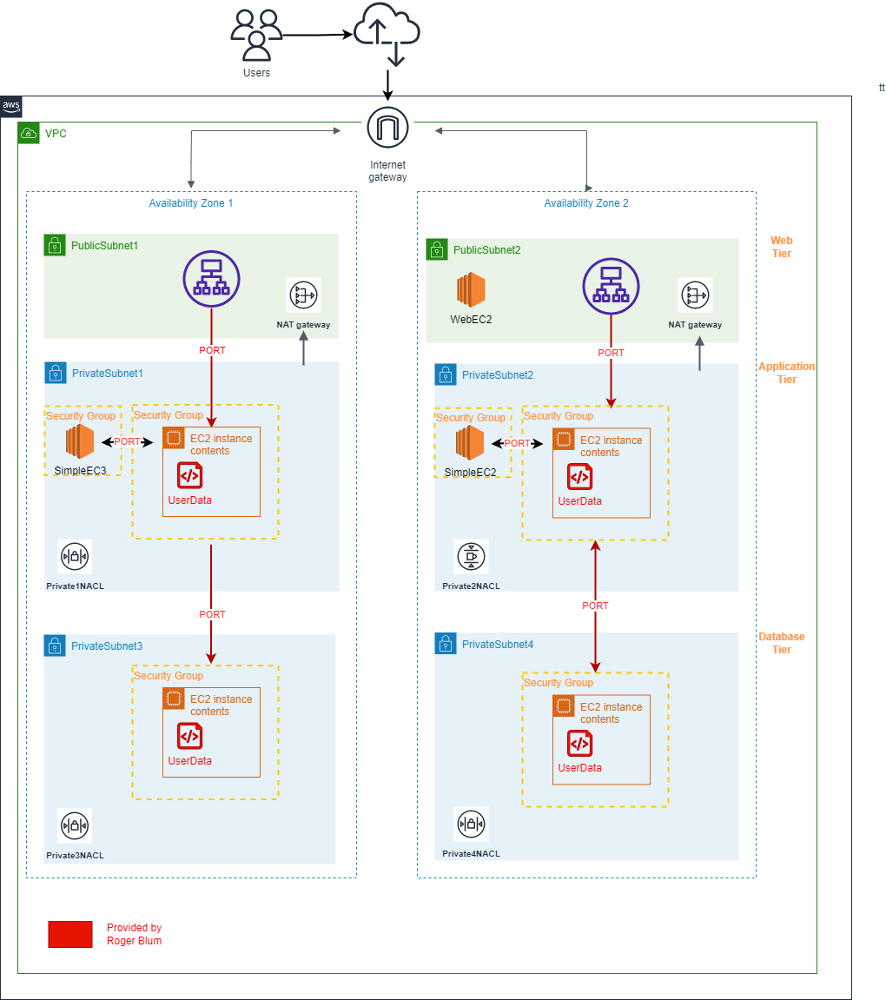
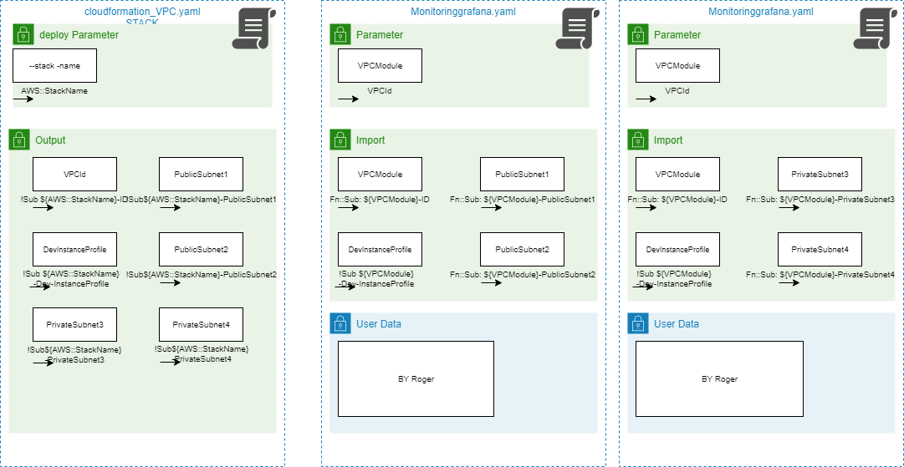

Definition Lean / Agile Project
==== 

Roger stellt die User data für Grafana und DB Server berreit. 

Implemenatin User Data to ec2 über github -> Dany 

## Table of Content

* 01 - [Our Kanban Board Explained](#01-Our-Kanban-Board-Explained)
* 02 - [Communication Collaboration](#02-Communication-Collaboration)
* 03 - [SMART Objectives](#03-SMART-Objectives)
* 04 - [Seusag](#04-Seusag)
* 05 - [Merge ](#05-Merge)
* 06 - [Dependencies](#06-Dependencies)


## 01 Our Kanban Board Explained
In order to visualize and manage our workflow in agile project, we are going to use the kanban board directly in Github as our project management tool.
The aim is to have a clear and visual representation of the entire workflow, allowing us to easily see the status of all the tasks and help to improve the collaboration and communication. 

We choose a lean and simple kanban board design, where the following columns represent the different stages/process of the project.

```
- Todo
- In Progress
- Done 
- Backlog
```


When there is a new task or work item that needs to be completed, we first open a new "issue" in the ITCNE23-SEM-1 Github repository. 

In this "issue" we contain information about the task, such as its Title, assignees, label, milestone, priority, start date, end date and any notes or details related to the task.


We have defined four different labels that are used to indicate what type of category the kanban card is in.

```
- documentation       - Improvements or additions to documentation 
- iac                 - Infrastructure as Code 
- monitoring          - POC Monitoring 
- project             - Agile Project 
```

In order to ensure that the project is on track and to measure its progress, we have defined four milestones.

```
- 1.Sprint            - Project kickoff finished, Individual tasks started iac and monitoring 
- 2.Sprint            - Definition and implementation of the dependencies and first testings iac - monitoring 
- 3.Sprint            - Finish prio A tasks, join the two project and extensive testing
- 4.Sprint            - Conclusion, Work acceptance and Presentation
```

When the "issue" is opened, it automatically appears in the kanban board "Todo" column.

From there, we can then move the card to the "In Progress" column to show that we are actively working on it.

When the task has been completed, we can move the card to the "Done" column to indicate that it has been completed. You will also be able to add any additional notes or comments about the task or issues that arose.

The "Backlog" column can be seen as a holding area for tasks that are waiting to be added to the board or moved to the "To Do" column. It is a useful tool for planning future work and ensure for a steady flow of tasks moving through the workflow. 

### Sprint completion
- 1. Sprint / 15.05.2023


- 2. Sprint / 14.06.2023

- 3. Sprint / 05.07.2023

- 4. Sprint / 12.07.2023


## 02 Communication Collaboration


In order to ensure total transparency for the auditors, the project communication will be carried out via a dedicated teams channel "ITCNE23-SEM-I communication".

Allows the sharing of updates and discussion of project related issues in a centralised and organised manner for effective communication between us.

**Collaboration**
Use a Git repository to make project collaboration as agile and lean as possible and define clear system boundaries.

## 03 SMART Objectives

###  IaC Infrastructure as Code Smart Goals


Here i list 4 smart goals for the IaC part of the project, to provide a clear roadmap.

**1. Goal: Automate Infrastructure Provisioning with CloudFormation**

```
- Specific:            - Develop a yaml CloudFormation templates to automate the provisioning of infrastructure resources in AWS. 
- Measurable:          - Successfully provision infrastructure resources using CloudFormation templates with running AWS Services in two different AZ's. 
- Achievable:          - I have done a lot of learning before and I have the knowledge to do it.
- Realistic:           - I have the time and the resources to do it.
- Timely:              - I have until 2.Sprint to finish the task.
```

**2. Goal: Deploy a Highly Available 3-Tier Architecture Across Two Availability Zones**

```
- Specific:            - Design and deploy a three-tier architecture across two AWS availability zones, ensuring high availability and fault tolerance. 
- Measurable:          - Successfully create and launch instances for each tier (web, application, database) in separate subnets.
- Achievable:          - Utilize AWS services like Amazon EC2, , Elastic Load Balancing to distribute resources across availability zones.
- Realistic:           - I understand the concepts and did already some lab about it.
- Timely:              - I have until 2.Sprint to finish the task.
```

**3. Goal: Implement VPC Gateway Endpoint for Amazon S3**

```
- Specific:            - Organize the infrastructure stacks into multiple vertical layers that build on top of one another
- Measurable:          - Make nested stacks for each layer and deploy them in the correct order.
- Achievable:          - Create separate stack templates for each layer and defining the appropriate resources and dependencies for each layer.
- Relevant:            - Implementing a VPC gateway endpoint for Amazon S3 will enhance security by allowing private access to S3 resources.
- Timely:              - Complete the configuration and testing of the VPC gateway endpoint for Amazon S3 within Sprint 2.
```

**4. Goal: Implement Layered Architecture for Stacks**

```
- Specific:            - Enabling private access to S3 resources by configure a VPC gateway endpoint. 
- Measurable:          - Ensuring that resources within the VPC can securely access S3 without traversing the internet gateway.
- Achievable:          - Utilize AWS VPC features and services to set up a VPC gateway endpoint specifically for Amazon S3.
- Relevant:            - Implementing a layered architecture will provide modularity and is alined with AWS best practices.
- Timely:              - Complete the implementation of the layered architecture for your stacks within Sprint 1. 
```

## 04 Seusag

I am going to deploy the infrastructure using CloudFormation and provide the underlying network infrastructure as shown in the diagram below.
This includes two Linux Ec2 instances with a web server installed on each one.

For the monitoring solution he is developing, Roger will provide the UserData code and the Port Matrix like highlighted in Red in the diagram below. 

And by implementing its user data in CloudFormation, I will integrate this monitoring solution into the infrastructure.

### iac Seusag

Here is a diagram showing the integration of the monitoring resources into the underlying AWS infrastructure and their interdependencies with interfaces and ports.



## 05 Dependencies

### iac Cross Stack Dependencies

Here is a diagram showing the cross stack dependencies for the IaC part of the project.
Where the VPC stack is the base stack and the other stacks are dependent on it, are built on top of it and Userdata information is provided by Roger.

