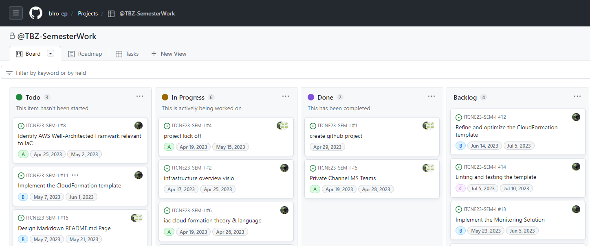
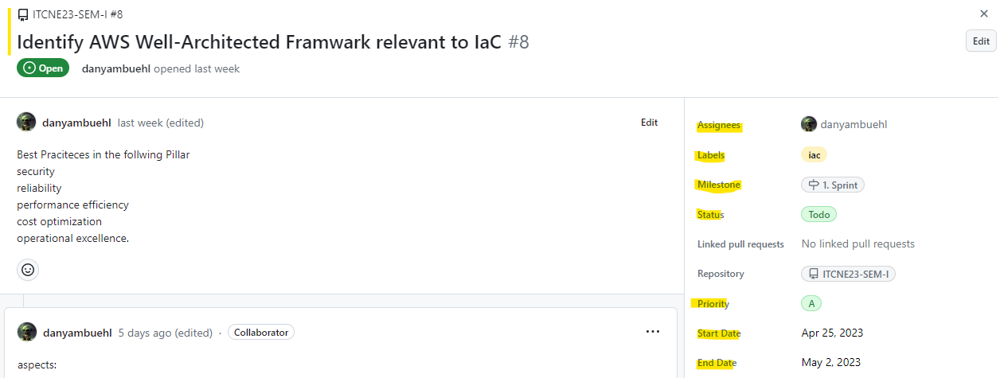
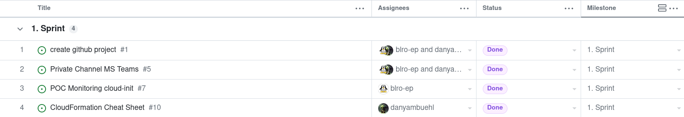
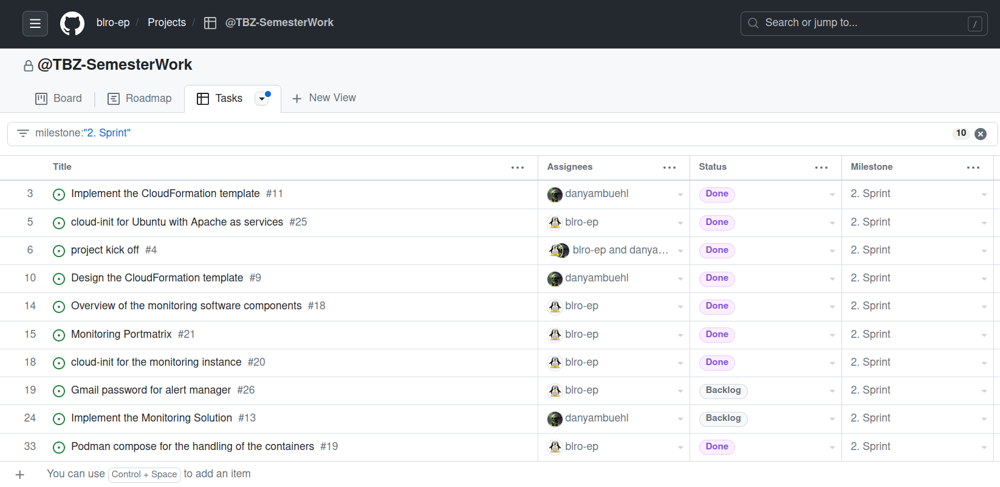
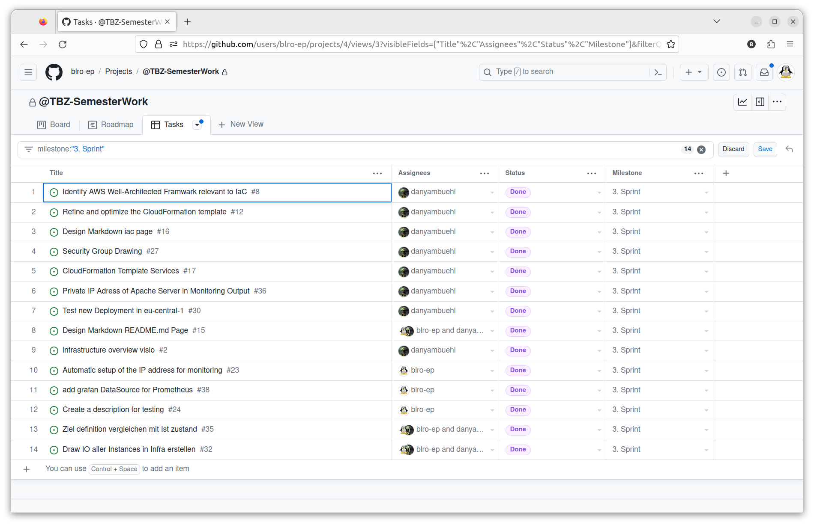
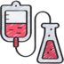

Definition Lean / Agile Project
==== 

## Table of Content

* 01 - [Our Kanban Board Explained](#01-Our-Kanban-Board-Explained)
* 02 - [Communication Collaboration](#02-Communication-Collaboration)
* 03 - [Sprint Completion](#03-sprint-completion)
* 04 - [Testing](#04-testing)

## 01 Our Kanban Board Explained
In order to visualize and manage our workflow in agile project, we are going to use the kanban board directly in Github as our project management tool.
The aim is to have a clear and visual representation of the entire workflow, allowing us to easily see the status of all the tasks and help to improve the collaboration and communication. 

We choose a lean and simple kanban board design, where the following columns represent the different stages/process of the project.

```
- Todo
- In Progress
- Done 
- Backlog
```



When there is a new task or work item that needs to be completed, we first open a new "issue" in the ITCNE23-SEM-1 Github repository. 
In this "issue" we contain information about the task, such as its Title, assignees, label, milestone, priority, start date, end date and any notes or details related to the task.



We have defined four different labels that are used to indicate what type of category the kanban card is in.

```
- documentation       - Improvements or additions to documentation 
- iac                 - Infrastructure as Code 
- monitoring          - POC Monitoring 
- project             - Agile Project 
```

In order to ensure that the project is on track and to measure its progress, we have defined four milestones.

```
- 1.Sprint            - Project kickoff finished, Individual tasks started iac and monitoring 
- 2.Sprint            - Definition and implementation of the dependencies and first testings iac - monitoring 
- 3.Sprint            - Finish prio A tasks, join the two project and extensive testing
- 4.Sprint            - Conclusion, Work acceptance and Presentation
```

When the "issue" is opened, it automatically appears in the kanban board "Todo" column.
From there, we can then move the card to the "In Progress" column to show that we are actively working on it.
When the task has been completed, we can move the card to the "Done" column to indicate that it has been completed. You will also be able to add any additional notes or comments about the task or issues that arose.
The "Backlog" column can be seen as a holding area for tasks that are waiting to be added to the board or moved to the "To Do" column. It is a useful tool for planning future work and ensure for a steady flow of tasks moving through the workflow. 


## 02 Communication Collaboration


In order to ensure total transparency for the auditors, the project communication will be carried out via a dedicated teams channel "ITCNE23-SEM-I communication".
Allows the sharing of updates and discussion of project related issues in a centralised and organised manner for effective communication between us.

**Collaboration**
Use a Git repository to make project collaboration as agile and lean as possible and define clear system boundaries.

## 03 Sprint completion

**1. Sprint / 15.05.2023**


**Keep**
- The decision to document the project in Github was a good one.<br>
- The project could be divided into individual tasks and offers a good and quick overview of the project with the Kanban board, roadmap and task list.<br>
- With github, you can work on the project independently of each other and all steps can be traced with the commits.<br>
- Switching from Docker to Podman in the POC (input from Marcello) worked well. Learned that podman / podman-compose can be operated using the same commands as docker. There were problems restarting the containers with Podman-Compose, but this could be fixed with an update from version 3.4.4 (Ubuntu Repo) to 4.5.1. .<br>
- I have learnt that the formation of Yaml can be a big pain in the ass and that there are good plugins for Visual Studio Code that can help with this.<br>
- Creating a cheat sheet takes a lot of time, but it is well worth every minute of it.<br>
- I learned how to deploy templates via AWS CLI.

**Drop**
- In another project, we will create github's table of contents differently. This version is too complex and not flexible.<br>
- The scope of the next project is going to be a lot smaller.<br>

**Try**
 - Access the experiences of faculty and peers faster before investing too much time in a task.<br>
 - Finding a solution for reading the IP address when starting up the monitoring instances.<br>
 - Find a solution for setting passwords so they are not visible in the git repo.<br>

**2. Sprint / 14.06.2023**


**Keep**
- The cooperation in the sub-projects (IaC / Monitoring) worked well.<br>
- Interfaces were discussed together and divided into tasks.<br>
- Visualizations of the network, security groups and monitoring overview was very helpful for general understanding.<br>
- The first solution to reading the IP address from generating the Monitoring Instances was only with cloud-init, which still required a bash script. Using Jinja templates was the better solution.<br>
- Through the testing I got to know the stress-ng program, which can be used to generate load on an ec2 instance.<br>
- Spending a lot of time with Cloudformation and other services was very helpful for the AWS architect exam.<br>
- AWS docs was very helpful in solving problems.<br>
- I learned what Circular Dependencies are and how to avoid them.<br>

**Drop**
- Stick to the original task and carefully question additional features that are not included in the task. These can quickly lead to a great deal of additional work.<br>
- A solution for the password problem was found using Secret Manager. Due to the complexity, there is no integration in IaC. The task goes into the backlog. A possible solution is documented in [Task-26](https://github.com/blro-ep/ITCNE23-SEM-I/issues/26).<br>
- opt-in for the AWS Free Tier. The costs for the project are not covered by the free tier.<br>
- optimize the cloudformation templates. The templates are very long and complex. The templates could be more modular.<br>

**Try**
- Prioritize the tasks better and move them to the backlog if necessary.<br>
- Better document the findings from the sprint (Keep / Drop / Try).<br>


**3. Sprint / 05.07.2023**


**Keep**
- The use of jinja templates in Cloud-Init has proven itself for reading the IP address when creating an instance. The template offers many exciting options.


**Drop**

**Try**


**4. . Sprint / 12.07.2023**


## 04 Testing



| Description | Test Step | Expected Result | Status | Screen |
| ---     | ---   | ---     | ---   |  ---   |
| `Region`| Deploy IaC in eu-central-1 | Stack complete| Stack complete | [Screenshot](images/regionf.png) |
| `Region`| Deploy IaC in eu-central-2 | Stack complete| Stack complete | [Screenshot](images/regionz.png) |
| `Region`| Deploy monitoring in eu-central-1 | Stack complete| Stack complete | [Screenshot](images/regionfm.png) |
| `Region`| Deploy monitoring in eu-central-2 | Stack complete| Stack complete | [Screenshot](images/regionzm.png) |
| `DevInstance`| Dev Instance Website | Shows possible connections | Shows connections | [Screenshot](images/devinstance.png) |
| `DevInstance`| Dev Instance SSM Connection | Hostname IP Address | ip-10-42-11-224.VPC-DEV01.internal | [Screenshot](images/devinstancessm.png) |
| `BasicInstance`| Basic Instance SSM Connection | Hostname IP Address | ip-10-42-21-181 | [Screenshot](images/basicinstancessm.png) |
| `BasicInstance`| Running Apache Server | curl IP Address | curl 10.42.21.181 | [Screenshot](images/basicinstance.png) |
| `GrafanaInstance`| Grafana Instance SSM Connection | Hostname IP Address | 10.42.21.146 | [Screenshot](images/grafanainstancessm.png) |
| `GrafanaInstance`| Dev Instance access to Grafana Web | Timeout | Timeout | [Screenshot](images/timeout.png) |
| `GrafanaInstance`| SSH access to Grafana Web | Timeout | Timeout | [Screenshot](images/timeout1.png) |
| `GrafanaInstance`| Ping google | Timeout | Timeout | [Screenshot](images/timeout2.png) |
| `Podman`| Check the Podman Containers are running | 4 Containers UP | 4 Containers UP | [Screenshot](images/check-podman-containers.png) |
| `Prometheus`| Check that the Prometheus UI is reachable and the targets are up | UI is reachable, targets up | UI is reachable, targets up | [Screenshot](images/check-prometheus-UI-targets.png) |
| `Grafana`| Check that the Grafana UI is reachable | UI reachable | UI reachable | [Screenshot](images/check-grafana-UI.png) <br> [Setup](images/Grafana-Setup.mp4) |
| `Blackbox-Exporter`| Check that the Blackbox-Exporter UI is reachable and Probes are available | UI reachable | UI reachable | [Screenshot](images/check-blackbox_exporter-UI.png) |
| `Alertmanager`| Check that the Alertmanager UI is reachable | UI reachable | UI reachable | [Screenshot](images/check-alertmanager-UI.png) |
| `Alertmanager`| Add gmailaddress / password to the config | Send email alerts | Send email alerts | [Screenshot-1](images/set-smtp-settings.png) <br> [Screenshot-2](images/send-smtp-alerts.png) |
| `Prometheus`| Add new targets to the prometheus config | after container restart up | after container restart up | [Screenshot](images/add-targets-prometheus.png) |
| `Podman`| Reload the new config via podman-compose | 4 Containers UP  | 4 Containers UP | [Screenshot](images/restart-container-podman-compose.png) |
| `EC2 Instance`| Generate CPU load to test the Grafana Dashboard and the Alertmanager | Trigger Alert  | Trigger Alert  | [Screenshot-1](images/generate-cpu-load.png) <br> [Screenshot-2](images/grafan-cpu-load.png) <br> [Screenshot-3](images/firing-cpu-alert.png) <br> [Screenshot-4](images/resolved-cpu-alert.png) |
| `EC2 Instance`| Generate MEM load to test the Grafana Dashboard and the Alertmanager | Trigger Alert  | Trigger Alert  | [Screenshot-1](images/generate-mem-load.png) <br> [Screenshot-2](images/grafan-mem-load.png) <br> [Screenshot-3](images/firing-mem-alert.png) <br> [Screenshot-4](images/resolved-mem-alert.png) |
| `EC2 Instance`| Stop apache service to check Blackbox-Exporter and the Alertmanager | Trigger Alert  | Trigger Alert  | [Screenshot-1](images/stop-apache-service.png) <br> [Screenshot-2](images/not-reachable-url.png) <br> [Screenshot-3](images/firing-url-alert.png) <br> [Screenshot-4](images/resolved-url-alert.png) |
